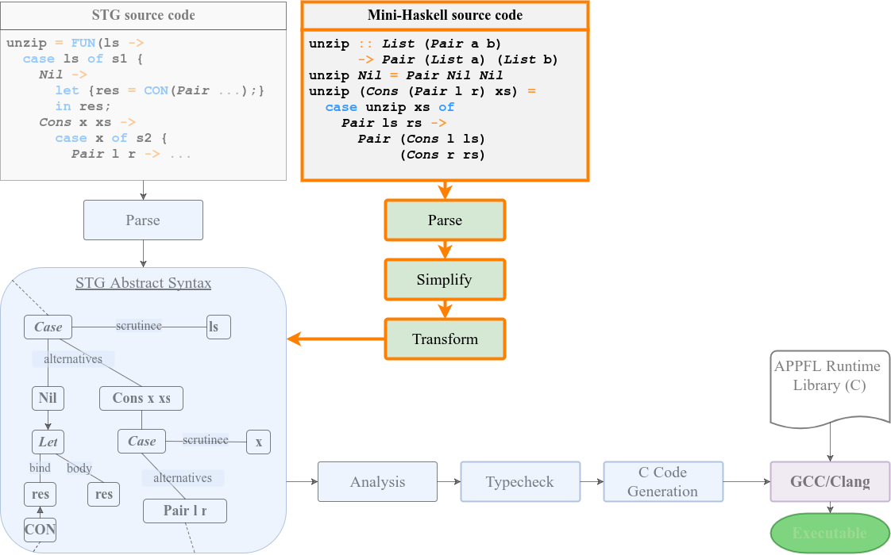
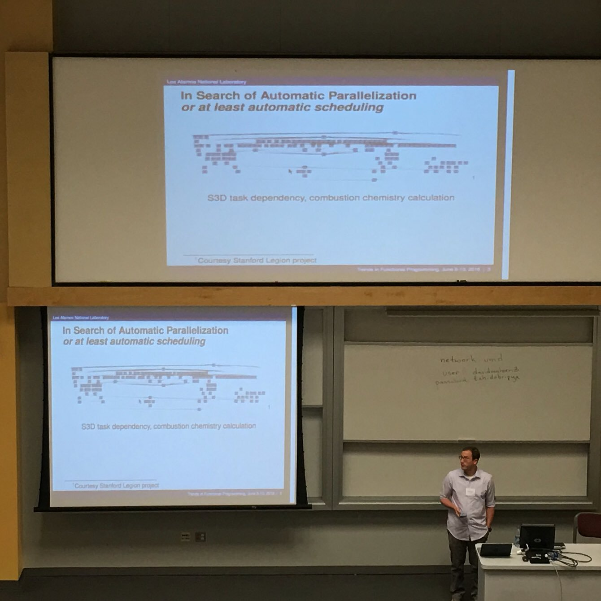

### Overview

> - My LANL internship experience 
>     - an advertisement for remaining students
> - A Haskell Primer
>     - Programming in a Purely Functional, Lazy language
> - The APPFL project
>     - Automatic Parallelization of Purely Functional programs
> - Demand analysis to reclaim the losses of laziness
>     - "Let's do the work we *know* we'll have to"


### My time at LANL

**How to turn an internship into an MSc with benefits in\
  Two summers of fun**


## Summer 2015

### Learn you a Haskell


### Learn how a simple compiler works (and contribute!)

{width=60%}

### Experience the pain of low-level programming (and make a better language!)
   
{width=60%}


## Summer 2016

### Speak at a conference

##### Trends in Functional Programming\
      University of Maryland

{width=40%}
{width=40%}


### Hack a *complex* compiler into your project

{width=60%}


### Present at the Student Symposium


### Get an award


## Capitalize on your work

### GEM and NPSC Graduate Fellowships at LANL

. . .

GEM : 
 Graduate Education for Minorities

NPSC : 
 National Physical Science Consortium
 
> - Up to $X of your graduate education paid for
> - Get paid while pursuing a masters degree
> - Have a job waiting for you when you're done


## A Brief Haskell Primer

### Haskell is ...

> - *Purely* Functional
>     - References are immutable
>     - Functions are first class
> - Lazy
>     - Expressions are only evaluated when absolutely necessary
>     - *More to come on this…*
> - Strongly and Statically Typed
>     - Types are not implicitly coerced
>     - Only type-correct programs will be compiled

<div class="notes">

Haskell's type system is very powerful.  It constrains programmers, which can be
frustrating at times, but is generally a good thing, eliminating large classes
of bugs.

</div>

## Interactive Demo

### Backup Demo - Arithmetic, Types

. . .
``` haskell
λ> 1 + 1
```
. . .

```
2
```
. . .

``` haskell
λ> 3 - 2 + 4
```
. . .

```
5
```
. . .

``` haskell
λ> 4 + "5"
```
. . .
```
<interactive>:2:3:
    No instance for (Num [Char]) arising from a use of ‘+’
    In the expression: 4 + "5"
    In an equation for ‘it’: it = 4 + "5"
```

### Booleans, `if-then-else` and `let`

. . .
```haskell
λ> True
```
. . .
```
True
```
. . .
```haskell
λ> if True then "Always" else "Never"
```
. . .
```
"Always"
```
. . .
```haskell
λ> 1 == 0
```
. . .
```
False
```
. . .
```haskell
λ> let myMathEducationLied = 0 == 1
λ> if myMathEducationLied then "Oh no!" else "Phew!"
```
. . .
```
"Phew!"
```

### Functions and pattern matching

. . .
```haskell
-- defined in a file Example.hs
doubleIt x = x + x
```
. . .
```haskell
λ> doubleIt 5
```
. . .
```
10
```
. . .
```haskell
-- also defined in Example.hs
addDoublesSometimes 1 2 = 0
addDoublesSometimes x y = doubleIt x + doubleIt y
```
. . .
```haskell
λ> addDoublesSometimes 1 2
```
. . .
```
0
```
. . .
```haskell
λ> addDoublesSometimes 2 1
```
. . .
```
6
```


### Lists and recursion

```haskell
λ> [1,2,3]
```
. . .
```
[1,2,3]
```
. . .
```haskell
λ> []
```
. . .
```
[]
```
. . .
```haskell
-- Length.hs
length [] = 0
length (x:xs) = 1 + length xs
```
. . .
```haskell
λ> length ["Peanut", "butter", "should", "be", "crunchy"]
```
. . .
```
5
```

<div class="notes">

- Lists can hold any (single) type of thing
- Lists may be empty
- Pattern matching makes list processing easy

</div>


### "Bottom": Exceptional Behavior and how it arises

. . .
```haskell
λ> undefined
```
. . .
```
*** Exception: Prelude.undefined
```
. . .
```haskell
λ> [error "PC LOAD LETTER", undefined]
```
. . .
```
[*** Exception: PC LOAD LETTER
```
. . .
```haskell
λ> length [error "Will this print?", undefined]
```
. . .

Any guesses?

. . .
```
2
```

<div class="notes">

Note the difference in the two "undefined" errors. Progress is made before the
error occurs.

</div>


### Referential Transparency and Performance
. . .
```haskell
-- Fib.hs
module Fib where

fib 0 = 0
fib 1 = 1
fib n = fib (n - 1) + fib (n - 2)

add4 a b c d = a + b + c + d

main1 = print result
  where result = add4 (fib 30) (fib 30) (fib 30) (fib 30)
```
. . .

But I'm no dummy. No need to repeat myself.

. . .
```haskell
-- Fib.hs, cont'd
main2 = print result
  where f30 = fib 30
        result = add4 f30 f30 f30 f30
```


### Referential Transparency and Performance
. . .
```
$ ghc -o fib1 -O0 -main-is Fib.main1 Fib.hs
$ ghc -o fib2 -O0 -main-is Fib.main2 Fib.hs
```
. . .
```
$ time ./fib1
3328160
./fib  0.74s user 0.00s system 99% cpu 0.751 total
```
. . .
```
$ time ./fib2
3328160
./fib  0.19s user 0.00s system 98% cpu 0.190 total
```
. . .

With no knowledge of how `fib` is written, could I have made the same change in
a C program?

<div class="notes">

No suprises in the timing results.

Important to emphasize that Haskell does not allow arbitrary side effects in
pure functions, so knowledge of `fib`'s implementation is not necessary.

</div>

## The APPFL Project - An Automatically Parallelized Pure Functional Language

### Referential Transparency and Parallelism

What if `result` from `Fib.hs` was instead

```haskell
result = add4 (fib 30) (fib 28) (fib 31) (fib 29)
```
. . .

There's an obvious opportunity for parallelism here.

. . .

In general …


<div class="notes">

Thanks to Haskell's semantics, we can prove that it's safe to parallelize
without changing the program's meaning.

</div>


### APPFL Currently

. . . 

> - Three front-ends: STG, Mini-Haskell, GHC
> - Serial implementation with garbage collection
> - Extensive test-suite
> - Rudimentary parallel runtime in active development
>     - Using Argonne's Argobots user-level threading library 
>     - Lock-free data structures for low overheads

<div class="notes">

- Argobots is similar to Sandia's qthreads
- Lock free data structures are worth looking into
    - They exploit low level hardware synchronization primitives (CAS, TAS)
      rather than mutexes (muticies?) or semaphores 
      
</div>


### Obstacles to Parallelism

> - Determining appropriate granularity of parallelism
>     - Heuristics are needed
> - **Preserving program semantics**

### When is it safe to evaluate?

```haskell
noMem = error "Out of Memory!" -- Pretend this really causes OOM
firstIfZero 0 x y = x
firstIfZero n x y = y
val1 = firstIfZero 0 "Foo" noMem
val2 = firstIfZero 1 noMem "Bar"
```
. . .

> - Both `val1` and `val2` are not bottom, given Haskell's laziness
> - Evaluation of all the arguments to `firstIfZero` *changes the program*


<div class="notes">

The OOM error is used here instead of `undefined` to emphasize that runtime errors are not
the only Bottom value that need to be considered.  Runtime errors could conceivably be
delayed until they were certain to be the "true" value of an expression.

</div>


### Potential solutions

> - Declare your language Strict
>     - Arguments to functions are evaluated before passed to a function
>     - APPFL has both strict and lazy modes
> - Perform *Strictness* or *Demand* Analysis
>     - Determine how well "defined" arguments must be
>     - More intuitively: \
>       What *must* be evaluated \
>       What *might* not be

<div class="notes">

- The explanation of a Strict language is a simplification, and describes operational
  semantics for intuition

</div>

## Demand Analysis

### Strictness and Weak Head Normal Form (WHNF)

> - A function is said to be *strict* in some argument *x* iff the function returns a
>   bottom value whenever *x* is a bottom value.
>     - `firstIfZero` is strict in its first argument, but not its second or third
> - Values are only evaluated as deep as necessary
>     - `length` required that its argument be a real, defined list though the elements 
>       could be bottom
> - Evaluating to WHNF evaluates the outermost constructor\
>   e.g. `(:)` ("cons") and `[]` ("nil")


<div class="notes">


</div>

### 


