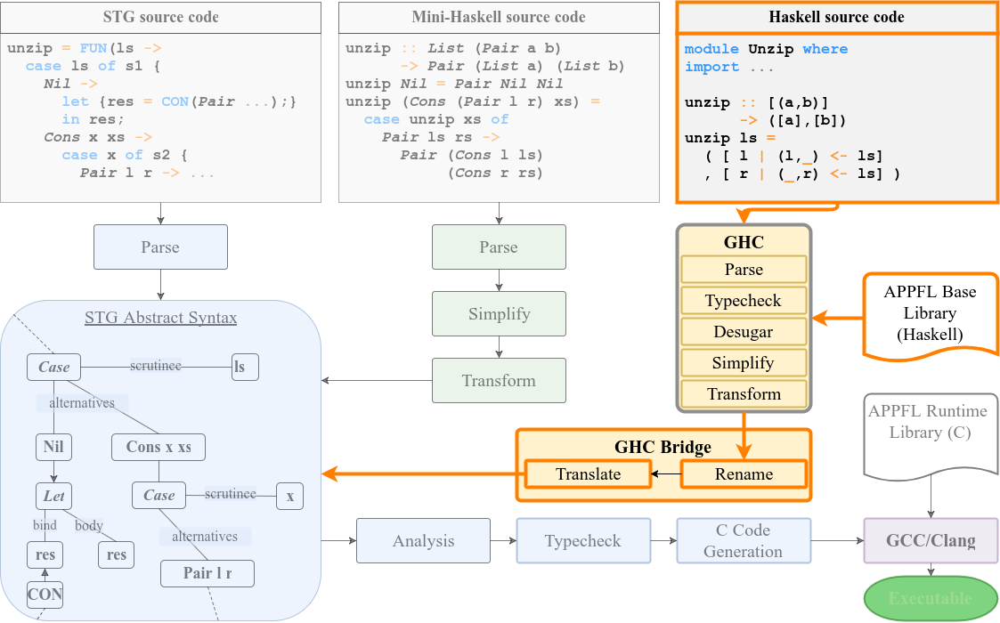

### Overview

> - My LANL internship experience 
>     - an advertisement for remaining students
> - A Haskell Primer
>     - Programming in a Purely Functional, Lazy language
> - The APPFL project
>     - Automatic Parallelization of Purely Functional programs
> - Demand analysis to reclaim the losses of laziness
>     - "Let's do the work we *know* we'll have to"


### My time at LANL

**How to turn an internship into an MSc with benefits in\
  Two summers of fun**


## Summer 2015

### Learn you a Haskell


### Learn how a simple compiler works (and contribute!)

{width=60%}

### Experience the pain of low-level programming (and make a better language!)
   
{width=60%}


## Summer 2016

### Speak at a conference

##### Trends in Functional Programming\
      University of Maryland

{width=40%}
{width=40%}


### Hack a *complex* compiler into your project

{width=60%}


### Present at the Student Symposium


### Get an award


## Capitalize on your work

### GEM and NPSC Graduate Fellowships at LANL

. . .

GEM : 
 Graduate Education for Minorities

NPSC : 
 National Physical Science Consortium
 
> - Up to $X of your graduate education paid for
> - Get paid while pursuing a masters degree
> - Have a job waiting for you when you're done


## A Brief Haskell Primer

### Haskell is ...

> - *Purely* Functional
>     - References are immutable
>     - Functions are first class
> - Lazy
>     - Expressions are only evaluated when absolutely necessary
>     - *More to come on this…*
> - Strongly and Statically Typed
>     - Types are not implicitly coerced
>     - Only type-correct programs will be compiled


## Interactive Demo

### Backup Demo - Arithmetic, Types

. . .
``` haskell
λ> 1 + 1
```
. . .

```
2
```
. . .

``` haskell
λ> 3 - 2 + 4
```
. . .

```
5
```
. . .

``` haskell
λ> 4 + "5"
```
. . .
```
<interactive>:2:3:
    No instance for (Num [Char]) arising from a use of ‘+’
    In the expression: 4 + "5"
    In an equation for ‘it’: it = 4 + "5"
```

### Booleans, `if-then-else` and `let`

. . .
```haskell
λ> True
```
. . .
```
True
```
. . .
```haskell
λ> if True then "Always" else "Never"
```
. . .
```
"Always"
```
. . .
```haskell
λ> 1 == 0
```
. . .
```
False
```
. . .
```haskell
λ> let myMathEducationLied = 0 == 1
λ> if myMathEducationLied then "Oh no!" else "Phew!"
```
. . .
```
"Phew!"
```

### Functions and pattern matching

. . .
```haskell
-- defined in a file Example.hs
doubleIt x = x + x
```
. . .
```haskell
λ> doubleIt 5
```
. . .
```
10
```
. . .
```haskell
-- also defined in Example.hs
addDoublesSometimes 1 2 = 0
addDoublesSometimes x y = doubleIt x + doubleIt y
```
. . .
```haskell
λ> addDoublesSometimes 1 2
```
. . .
```
0
```
. . .
```haskell
λ> addDoublesSometimes 2 1
```
. . .
```
6
```


### Lists, recursion and pattern-matching

```haskell
λ> [1,2,3]
```
. . .
```
[1,2,3]
```
. . .
```haskell
λ> []
```
. . .
```
[]
```
. . .
```haskell
-- Length.hs
length [] = 0
length (x:xs) = 1 + length xs
```
. . .
```haskell
λ> length ["Peanut", "butter", "should", "be", "crunchy"]
```
. . .
```
5
```

<div class="notes">

- Lists can hold any (single) type of thing
- Lists may be empty
- Pattern matching makes list processing easy

</div>


### Exceptional Behavior: "Bottom"

. . .
```haskell
λ> undefined
```
. . .
```
*** Exception: Prelude.undefined
```
. . .
```haskell
λ> [error "PC LOAD LETTER", undefined]
```
. . .
```
[*** Exception: PC LOAD LETTER
```
. . .
```haskell
λ> length [error "Will this print?", undefined]
```
. . .

Any guesses?

. . .
```
2
```

<div class="notes">

Note the difference in the two "undefined" errors. Progress is made before the
error occurs.

</div>
